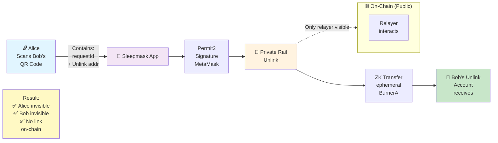
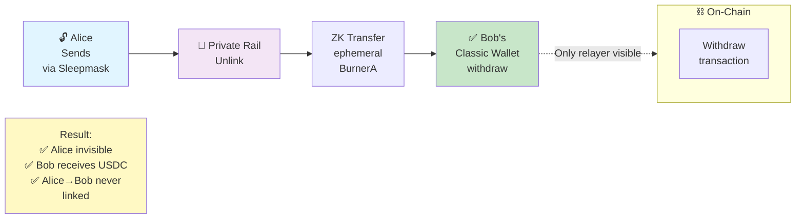
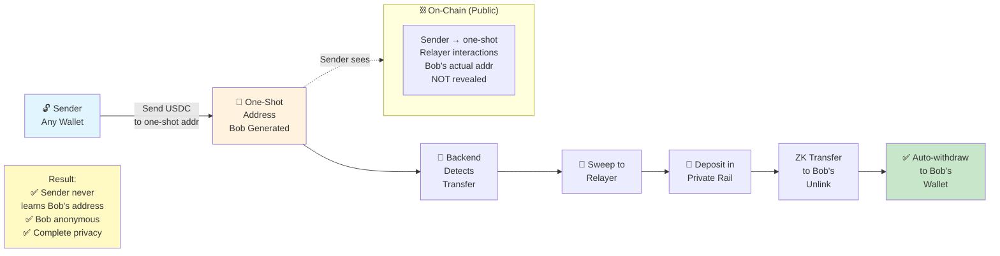
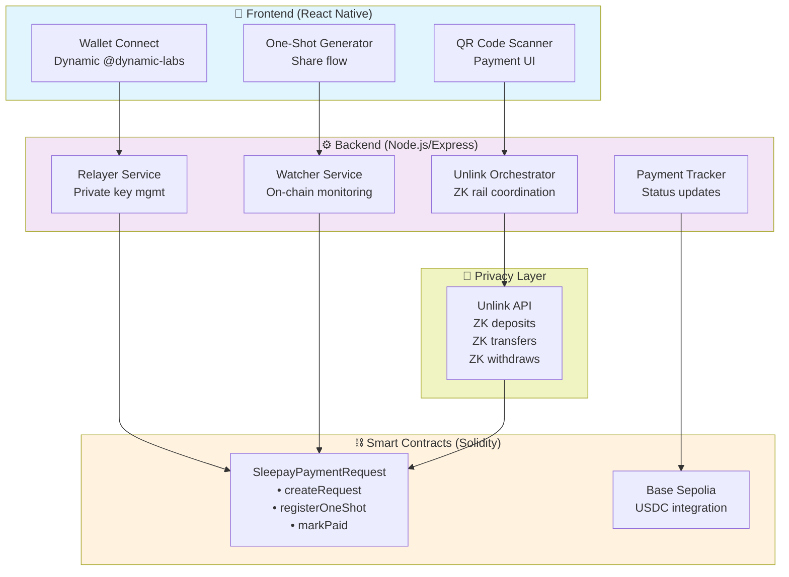
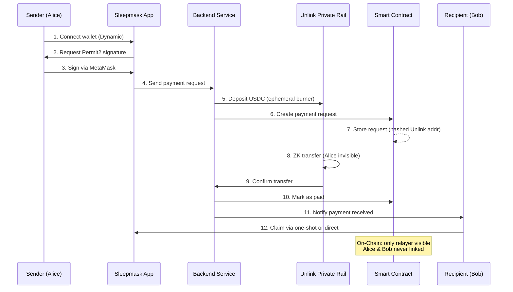
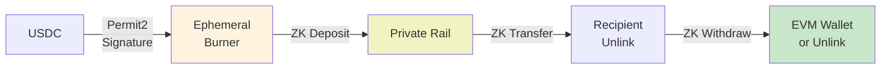

# 🎭 Sleepmask

**Privacy-first crypto payments on Base** — send and receive USDC without exposing your wallet, balance, or transaction history on-chain.

## 🎯 The Problem

Every EVM payment is **fully public**. When you pay someone:
- Your entire wallet history is exposed
- Your balance becomes visible
- Every transaction you've made is linkable
- There is **no privacy layer** for everyday crypto payments

## 💡 The Solution

Sleepmask wraps every payment in a **zero-knowledge private transfer** via [Unlink](https://unlink.xyz). 

On-chain, **only the relayer is visible** — Alice and Bob are never linked together in any transaction. The payment flows through an ephemeral private rail where both parties are completely anonymous.

---

## 🏗️ How It Works — 3 Payment Cases

### Case 1️⃣ Sleepmask → Sleepmask (Maximum Privacy)



### Case 2️⃣ Sleepmask → Classic Wallet



### Case 3️⃣ Classic Wallet → Sleepmask (One-Shot Address)



---

## 📊 Architecture



---

## 🔧 Tech Stack

| Layer | Technology |
|-------|-----------|
| **Mobile** | React Native 0.84 (Hermes) — iOS & Android |
| **Wallet** | Dynamic (wallet connect) + WalletConnect (signing) |
| **Backend** | Node.js / Express + TypeScript |
| **Smart Contract** | Solidity / Hardhat on Base Sepolia |
| **Privacy** | Unlink ZK rail on Base |
| **Token** | USDC `0x036CbD53842c5426634e7929541eC2318f3dCF7e` |
| **Signatures** | Permit2 via MetaMask / WalletConnect |

---

## 🤝 Payment Flow Diagram



---

## 🎯 Key Features

### 🔐 Zero-Knowledge Privacy
- ZK proofs hide sender & recipient
- Private transfers via Unlink
- On-chain: only relayer interactions visible

### 📱 Mobile-First Design
- React Native for iOS & Android
- Dynamic for seamless wallet integration
- Hermes engine for performance

### 🎲 Flexible Payment Modes
- **Sleepmask → Sleepmask**: Maximum privacy, both in app
- **Sleepmask → Wallet**: Privacy for sender, flexibility for recipient
- **Wallet → Sleepmask**: Sender doesn't know recipient identity

### ⚡ Smart Contract
`SleepayPaymentRequest` manages the lifecycle:
```solidity
• createPaymentRequest(requestId, unlinkAddressHash, amount, ttl)
• registerOneShot(requestId, oneshotAddress)
• notifyReceived(requestId, amount)
• markPaid(requestId, amount)
```

---

## 🚀 Local Development

### Backend Setup

```bash
cd backend
cp .env.example .env

# Fill in:
# - EVM_PRIVATE_KEY: relayer private key
# - UNLINK_API_KEY: Unlink service key
# - CONTRACT_ADDRESS: SleepayPaymentRequest address
# - BASE_SEPOLIA_RPC: RPC endpoint

npm install
npm run dev
# Runs on http://localhost:3000
```

### Mobile Setup

```bash
cd mobile
npm install

# iOS (simulator)
npx react-native run-ios

# Android (emulator)
npx react-native run-android

# Android release build
npx react-native bundle --platform android --dev false \
  --entry-file index.js \
  --bundle-output android/app/src/main/assets/index.android.bundle
cd android && ./gradlew assembleRelease
adb install -r app/build/outputs/apk/release/app-release.apk
```

### Smart Contracts

```bash
cd contracts
npm install
npx hardhat compile
npx hardhat test
npx hardhat run scripts/deploy.ts --network baseSepolia
```

---

## 🔑 Environment Variables

```bash
# Backend .env
EVM_PRIVATE_KEY=0x...
UNLINK_API_KEY=your_unlink_key
CONTRACT_ADDRESS=0x...
BASE_SEPOLIA_RPC=https://sepolia.base.org
BACKEND_URL=http://localhost:3000

# Contracts .env
PRIVATE_KEY=0x...
BASE_SEPOLIA_RPC=https://sepolia.base.org
```

---

## 🧪 Testing

### Backend
```bash
npm run test          # Unit tests
npm run test:watch   # Watch mode
npm run test:coverage # Coverage report
```

### Contracts
```bash
npx hardhat test
npx hardhat test --coverage
```

### Mobile
```bash
npm run test          # Jest
npm run test:watch
```

---

## 🏆 Built at ETHGlobal

This project was built during an ETHGlobal hackathon using:

- **[Dynamic](https://dynamic.xyz)** — Wallet connection on React Native, Permit2 signing via WalletConnect protocol
- **[Unlink](https://unlink.xyz)** — Zero-knowledge private transfer rail, seamless deposit/transfer/withdraw pipeline
- **[Base](https://base.org)** — Fast, cheap, EVM-compatible L2 with native USDC

---

## 📚 Key Integrations

### Unlink ZK Rail


### Dynamic Wallet Connect
- Supports MetaMask, WalletConnect, Rainbow, Coinbase Wallet
- React Native compatible
- Permit2 signature flow

### Base Sepolia Smart Contract
- Immutable payment request registry
- Hashed recipient addresses (privacy)
- One-shot address support
- Relayer coordination

---

## 🐛 Known Limitations

- **Testnet only** (Base Sepolia) — production deployment pending audits
- **Rate limiting** on Unlink API for testing
- **MetaMask signing** required for Permit2 (iOS limitation)
- **One-shot TTL** — addresses expire after 30 minutes

---

## 🔮 Future Roadmap

- [ ] Multi-token support (USDC, ETH, native assets)
- [ ] Cross-chain privacy (Base → Ethereum)
- [ ] Group payments (split costs privately)
- [ ] Recurring payments (subscriptions)
- [ ] Mobile-to-mobile direct transfer
- [ ] Audit & mainnet deployment
- [ ] Web interface

---

## 📖 References

- **Dynamic**: [Docs](https://docs.dynamic.xyz/) • [React Native](https://docs.dynamic.xyz/react-native)
- **Unlink**: [Documentation](https://docs.unlink.xyz)
- **Base**: [Documentation](https://docs.base.org)
- **Permit2**: [Github](https://github.com/Uniswap/permit2)

---

**Built with ❤️ and 48 hours of sleep deprivation** 😴

Sleepmask — where privacy meets payments.
